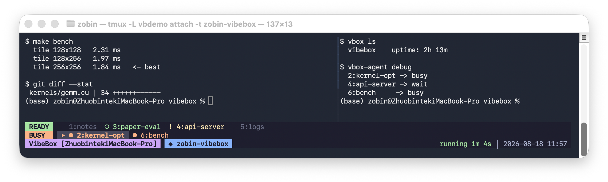

# VibeBox

A simple tool to keep your coding agents running.



## Install

```bash
curl -fsSL -H 'Accept: application/vnd.github.v3.raw' https://api.github.com/repos/zobinHuang/vibebox/contents/setup.sh | bash
```

## Usage

```bash
# create a session and attach to it
vbox new <name>

# attach to an existing session
vbox attach <name>

# list sessions
vbox ls

# kill a session by name
vbox kill <name>

# kill the session you're in
vbox exit
```

[Keybindings](docs/keybindings.md)
